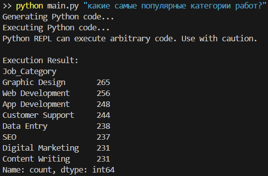

# CLI для анализа доходов

Этот проект представляет собой инструмент командной строки (CLI) для анализа данных о доходах фрилансеров из CSV-файла. Он использует большую языковую модель (LLM) для перевода запросов на естественном языке в код Python, который затем выполняется для получения ответа.

## Возможности

* **Запросы на естественном языке:** Задавайте вопросы о ваших данных о доходах на простом языке.
* **На базе LLM:** Использует большую языковую модель для генерации кода Python для анализа данных.
* **Интеграция с Pandas:** Использует мощную библиотеку pandas для обработки и анализа данных.
* **Расширяемость:** Построен на LangChain и LangGraph, что позволяет создавать более сложные рабочие процессы анализа.

## Начало работы

### Предварительные требования

* Python 3.8+
* pandas
* typer
* langchain
* langchain-openai
* langchain-experimental
* langchain-core
* langgraph

### Установка

1. **Клонируйте репозиторий:**
    ```bash
    git clone https://github.com/legodark-hub/Freelancer-earnings-analyzer.git
    cd income-analyzer
    ```

2. **Создайте и активируйте виртуальное окружение:**
    ```bash
    python -m venv .venv
    source .venv/bin/activate  
    # В Windows используйте `.venv\Scripts\activate`
    ```

3. **Установите зависимости:**
    ```bash
    pip install -r requirements.txt
    ```

4. **Создайте файл `.env`** в корне проекта и добавьте следующие переменные окружения:
    ```
    CSV_PATH="путь/к/вашему/freelancer_earnings_bd.csv"
    LLM_BASE_URL="ваш_базовый_url_llm"
    LLM_API_KEY="ваш_api_ключ_llm"
    MODEL_NAME="имя_вашей_модели_llm"
    ```

## Использование

Для использования CLI запустите скрипт `main.py` с вашим запросом в качестве аргумента.

```bash
python main.py "Ваш запрос на естественном языке о данных"
```

### Пример

```bash
python main.py "Какие самые популярные категории работ?"
```

После этого инструмент:
1. Сгенерирует код Python для ответа на ваш вопрос.
2. Выполнит код.
3. Выведет результат в консоль.

